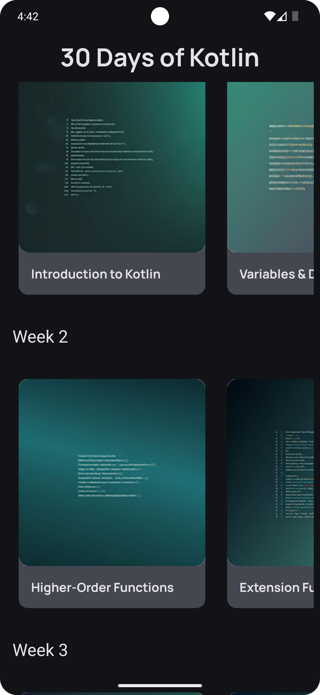
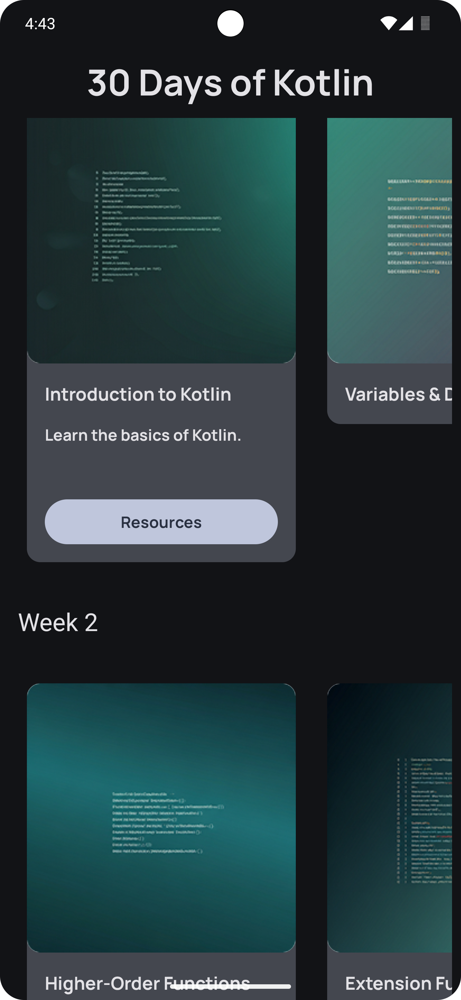
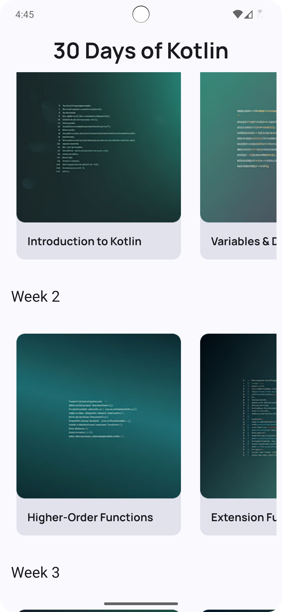
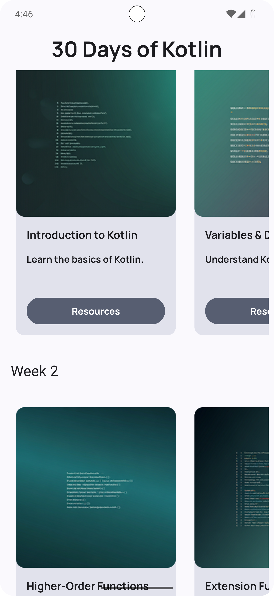

# 🚀 30 Days of Kotlin

This is an **Android application** built using **Jetpack Compose**, developed as part of **Unit 3** of the Android Compose training. The UI was entirely **self-thought** and implemented using **Figma** and **Stitch AI** for design refinement.

---

## 📜 Overview
The **30 Days of Kotlin** app is designed to provide a **structured learning experience** for Kotlin and Jetpack Compose. It covers **fundamental Kotlin concepts**, **Jetpack Compose UI development**, and **advanced Android topics**.

---

## 🚀 Features
✅ **Structured 4-week learning plan** covering Kotlin and Jetpack Compose  
✅ **Scrollable week-based navigation** using `LazyColumn` and `LazyRow`  
✅ **Expandable sections** for detailed explanations  
✅ **Resource links** for each lesson  
✅ **Material 3 components** for a modern UI  
✅ **Custom UI elements** designed in **Figma** and refined using **Stitch AI**

---

## 🛠️ Tech Stack
- **Kotlin** 🧑‍💻
- **Jetpack Compose** 💡
- **State Management (`remember`, `mutableStateOf`)** ⚡
- **Material 3 Components (`Scaffold`, `Surface`, `Card`)** 🎨
- **Android Studio** 🏗️
- **Figma & Stitch AI** (for UI design)

---

## 📷 App Screenshots

<table>
  <tr>
    <td></td>
    <td>&nbsp;&nbsp;&nbsp;&nbsp;</td>
    <td></td>
    <td>&nbsp;&nbsp;&nbsp;&nbsp;</td>
    <td></td>
    <td>&nbsp;&nbsp;&nbsp;&nbsp;</td>
    <td></td>
  </tr>
</table>

---

## ✨ Code Highlights
1️⃣ **Week-Based Navigation**
```kotlin
LazyColumn {
    items(studyPlan) { week ->
        WeekScreen(week)
    }
}
```

2️⃣ **Expandable Card UI**
```kotlin
Card(
    modifier = Modifier.width(240.dp),
    onClick = { expanded = !expanded }
) {
    Column {
        Text(day.title, style = MaterialTheme.typography.displayLarge)
        if (expanded) {
            Text(day.description, style = MaterialTheme.typography.bodyLarge)
        }
    }
}
```

---

## 🔗 Resources & Links
- [Kotlin Official Documentation](https://kotlinlang.org)
- [Jetpack Compose Guide](https://developer.android.com/jetpack/compose)


<div style="display: flex; overflow-x: auto; gap: 10px;">
    
    
    
    
</div>

